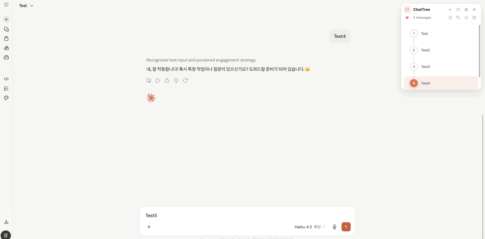

# ChatTree (v1.0.0-beta)

> **Navigate your AI conversations like a map, not a scroll.**  
> A Chromium extension that visualizes your chat session as an interactive tree — so you never lose track of where you were.

<div align="center">



</div>

</br>

<div align="center">

[](./LICENSE) []() []() [](./CONTRIBUTING.md)

🌐 [Chrome Web Store](https://chromewebstore.google.com/detail/chattree/flamopjfedkffcfofoibkgbhoajnopnc) · 🌐 [Edge Add-ons](https://microsoftedge.microsoft.com/addons/detail/chattree/lcgceaigpbkibamcpfjbgedmijmilcmi) · 📖 [User Guide](./docs/USER_GUIDE.md) · 🤝 [Contributing](.github/CONTRIBUTING.md) · 👥 [Contributors](.github/CONTRIBUTORS.md)

</div>

## 1. Problem

AI chatbot sessions grow long and complex — especially when you edit previous prompts and create branching conversations. Finding a specific exchange requires endless scrolling, and there's no visual overview of where you are in the conversation.

**ChatTree solves this** by floating an interactive tree-map navigator directly inside your chat UI.

## 2. Features

- 🗺️ **Tree-map navigator** — visualizes every chatbox as a node, floated over the chat UI
- 💬 **Hover to preview** — mouse over any node to see the original full prompt in a popup
- 🖱️ **Click to jump** — click any node to instantly scroll that chatbox to the top of the page
- 🌿 **Branch tracking** — branch nodes show count (e.g., `1/3`) with a dotted-line indicator; only displayed when other branches actually exist
- ✨ **Dynamic highlight** — the active chat highlight moves dynamically as you navigate
- 🔍 **Chat search** — search for specific messages within the current session
- 🔖 **Bookmarks** — bookmark specific chats within a session for quick access
- 🏷️ **Tag management** — add and manage tags on chats within a session

## 3. Supported Platforms

| Platform           | Status       |
| ------------------ | ------------ |
| Claude (claude.ai) | ✅ Supported |
| ChatGPT            | 🔜 Planned   |
| Gemini             | 🔜 Planned   |

## 4. Getting Started

### 4-1.Prerequisites

- Chrome or any Chromium-based browser (Edge, Brave, Arc, etc.)
- Node.js >= 18

### 4-2. Installation (Development)

```bash
# 1. Clone the repository
git clone https://github.com/MintCat98/ChatTree.git
cd ChatTree

# 2. Install dependencies
npm install

# 3. Build the extension
npm run build

# 4. Load in Chrome
# Open chrome://extensions → Enable Developer Mode → Load Unpacked → Select /dist folder
```

### 4-3. Installation (Stable Release)

You can install ChatTree directly from the official extension stores:

- **Chrome Web Store**: [ChatTree on Chrome Web Store](https://chromewebstore.google.com/detail/chattree/flamopjfedkffcfofoibkgbhoajnopnc)
- **Microsoft Edge Add-ons**: [ChatTree on Edge Add-ons](https://microsoftedge.microsoft.com/addons/detail/chattree/lcgceaigpbkibamcpfjbgedmijmilcmi)

## 5. Architecture

```
src/
├── background/       # Service Worker (Manifest V3)
├── content/          # Content Script — DOM parsing & tree rendering
├── popup/            # Extension popup UI
├── options/          # Options page
└── shared/           # Shared utilities & types
```

## 6. Contributing

We welcome all contributions — bug reports, feature suggestions, and pull requests!  
Please read [CONTRIBUTING.md](.github/CONTRIBUTING.md) first.

## 7. Team

See [CONTRIBUTORS.md](.github/CONTRIBUTORS.md) for the full list.

## 8. License

This project is licensed under the **Apache License 2.0**.  
See [LICENSE](./LICENSE) for details.
