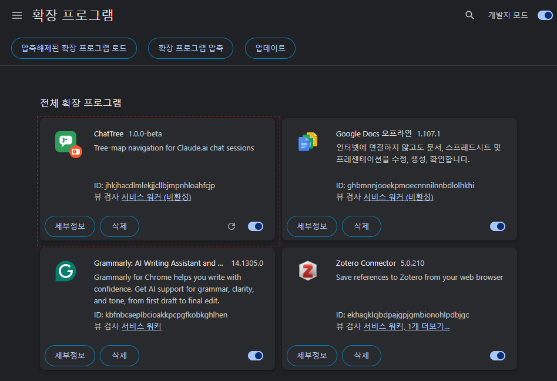
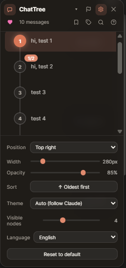
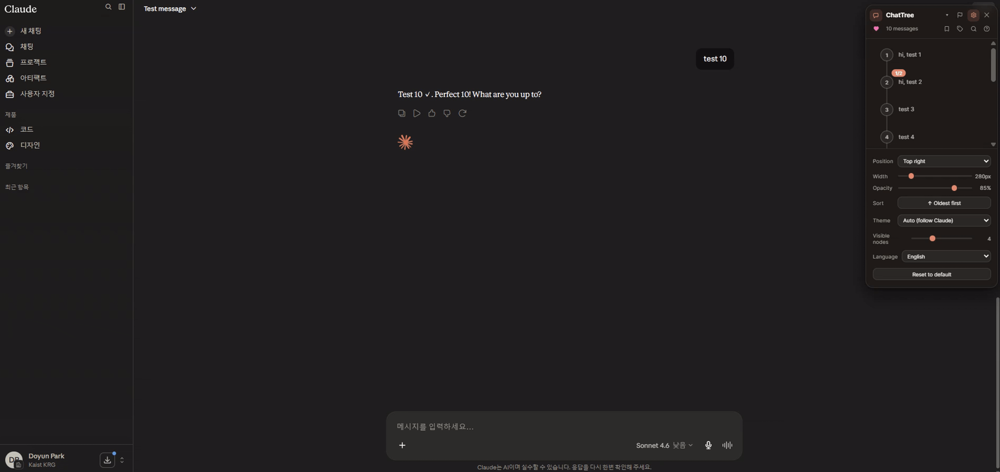
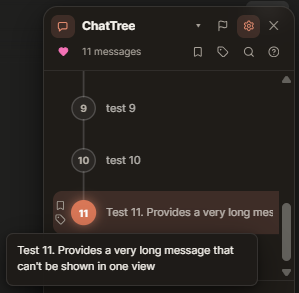
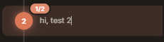
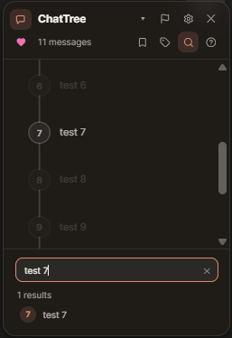
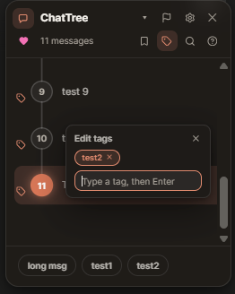
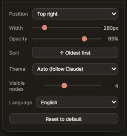

# ChatTree — User Guide

> **Navigate your AI conversations like a map, not a scroll.**

ChatTree is a Chromium browser extension that floats an interactive tree-map panel directly inside [claude.ai](https://claude.ai), giving you a bird's-eye view of your entire conversation. Every message becomes a node you can click, hover, search, or bookmark — no more endless scrolling to find where you were.

---

## Table of Contents

1. [Installation](#1-installation)
2. [Interface Overview](#2-interface-overview)
3. [Core Features](#3-core-features)
   - [Tree-Map Navigator](#31-tree-map-navigator)
   - [Click to Jump](#32-click-to-jump)
   - [Hover to Preview](#33-hover-to-preview)
   - [Branch Tracking](#34-branch-tracking)
   - [Dynamic Highlight](#35-dynamic-highlight)
   - [Tree Map Auto-Scroll](#36-tree-map-auto-scroll)
4. [Productivity Features](#4-productivity-features)
   - [Chat Search](#41-chat-search)
   - [Bookmarks](#42-bookmarks)
   - [Tag Management](#43-tag-management)
5. [Settings](#5-settings)
6. [Feedback](#6-feedback)

---

## 1. Installation

### From the Chrome Web Store *(coming soon)*

> The Chrome Web Store listing is currently in progress. Once published, you will be able to install ChatTree in one click.

### Developer Mode (Manual Install)

1. **Clone the repository and build**
**Prerequisite:** Node.js 18 or higher must be installed.

   ```bash
   git clone https://github.com/MintCat98/ChatTree.git
   cd ChatTree
   npm install
   npm run build
   ```

2. **Load the extension in Chrome**
   - Go to `chrome://extensions`
   - Enable **Developer mode** (toggle in the top-right corner)
   - Click **Load unpacked**
   - Select the `dist/` folder inside the project directory

3. **Open [claude.ai](https://claude.ai)** — the ChatTree panel will appear automatically.

<div align="center">

    

</div>

---

## 2. Interface Overview

Once installed, ChatTree injects a floating panel over the claude.ai interface. The panel shows your entire conversation as a tree of nodes and updates in real time as the chat progresses.

To **show or hide** the panel, use the enable/disable toggle in the panel header.

<div align="center">

    

</div>

---

## 3. Core Features

### 3.1 Tree-Map Navigator

Every message in your conversation is represented as a **node** in the tree. Nodes are arranged top-down, reflecting the order of the conversation. The tree updates automatically whenever a new message is added.

<div align="center">

    

</div>

---

### 3.2 Click to Jump

Click any node in the tree to instantly scroll that message to the **top of the page**. This works for both your prompts and AI responses anywhere in a long conversation.

<div align="center">

    

</div>

---

### 3.3 Hover to Preview

Hover over any node to see a **popup showing the original full prompt** for that message. This lets you quickly identify messages without leaving the current scroll position.

<div align="center">

    

</div>

---

### 3.4 Branch Tracking

When you edit a previous prompt and regenerate a response, Claude creates a branch. ChatTree detects this automatically and shows a **branch badge** (e.g., `1/3`) on affected nodes. A dotted-line indicator connects branching paths.

The badge and dotted line are only shown **when other branches actually exist** — nodes on a linear path stay clean.

<div align="center">

    

</div>

---

### 3.5 Dynamic Highlight

The **active message highlight** in the tree panel moves dynamically as you scroll through the conversation. The highlighted node always reflects the message currently closest to the top of your viewport.

<div align="center">

    

</div>

---

### 3.6 Tree Map Auto-Scroll

As the active node changes, the tree map panel **automatically scrolls** to keep the active node in view. You never need to manually scroll the panel to find where you are.

<div align="center">

    

</div>

---

## 4. Productivity Features

### 4.1 Chat Search

Use the **search bar** at the top of the panel to find specific messages within the current session. Matching nodes are highlighted in the tree as you type.

<div align="center">

    

</div>

---

### 4.2 Bookmarks

**Bookmark** any message node to pin it for quick access. Bookmarked nodes are visually marked in the tree so you can return to important parts of a conversation at any time.

<div align="center">

    

</div>

---

### 4.3 Tag Management

**Add tags** to any message node to categorize or annotate conversations. Tags appear on the node in the tree and can be managed (added, edited, removed) at any time during a session.

<div align="center">

    

</div>

---

## 5. Settings

Open the **Settings panel** from the panel header to customize ChatTree's behavior.

<div align="center">

    

</div>

### Language

Switch the panel UI language between **Korean** and **English**. The selected language applies immediately.

### Sort Order

Choose whether conversation nodes are displayed in **ascending** (oldest first) or **descending** (newest first) order.

### Panel Height

Adjust the number of nodes visible at once without scrolling. You can configure the panel to display **up to 8 nodes** simultaneously, with the panel height scaling accordingly.

### Reset to Default

Click **Reset to Default** to restore all settings (language, sort order, panel height) to their original values in one click.

---

## 6. Feedback

Found a bug or have a suggestion? Use the **Feedback** button in the panel header to go directly to the GitHub Issues page and open a new report.

You're also welcome to contribute via pull request — see [CONTRIBUTING.md](../.github/CONTRIBUTING.md) for guidelines.
